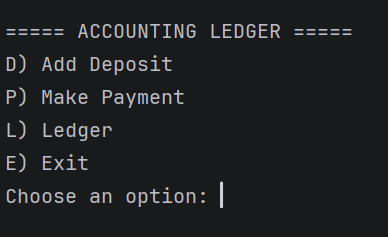
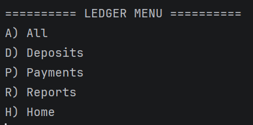
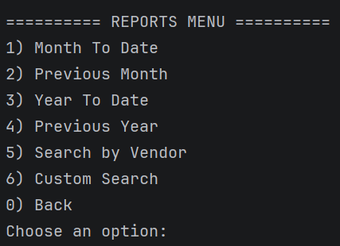

# Accounting Ledger Application
## Overview
Accounting Ledger Application is a Java console application that allows users to track financial transactions. Users can record deposits, payments, and view transaction history through an interactive command-line menu.
## Features
### Home Screen


### Ledger Screen



### Reports

## Technologies Used
- Java
- Object-Oriented Programming
- File I/O
- CSV Data Storage
- ArrayList
- HashMap
- LocalDate / LocalTime
- Git & GitHub

## Challenges & Lessons Learned
The most challenging part of the project was implementing the custom search logic. Since every field was optional, I had to design a system that only applied filters when the user entered values. This helped me better understand loops, conditionals, null handling, and clean search logic.
```java
if(startDate != null && transaction.getDate().isBefore(startDate)){
    continue;
}

if(!vendor.isEmpty() && !transaction.getVendor().equalsIgnoreCase(vendor)){
     continue;
}